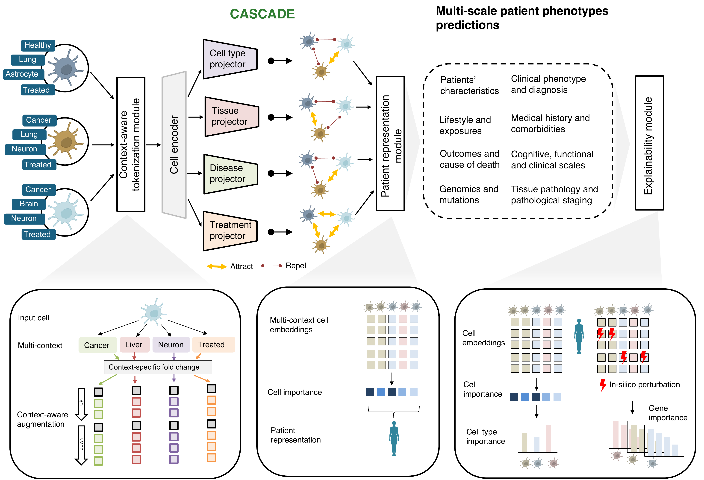
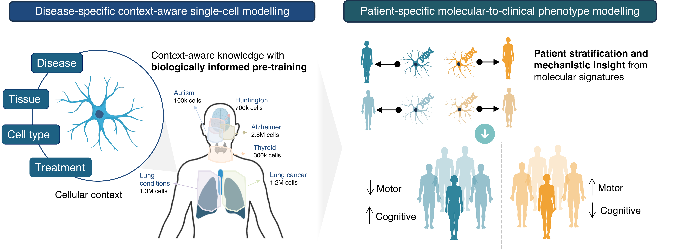

<p align="center">
  <a href="https://zitniklab.hms.harvard.edu/CASCADE-website/">
    
  </a>
</p>

<h2 align="center">CASCADE: context-aware single-cell modelling links cellular programmes to patient-level disease phenotypes</h2>

<p align="center">
  <a href="https://zitniklab.hms.harvard.edu/CASCADE-website/"></a>
  <a href="https://github.com/mims-harvard/CASCADE"></a>
  
  <a href="https://huggingface.co/mims-harvard"></a>
</p>

CASCADE is a context-aware, multiscale single-cell foundation model. During pre-training it
conditions each cell's representation on the biological context in which it was observed —
disease state, tissue, cell type, and treatment condition — by tokenizing cells as
context-dependent up-/down-regulated gene sequences rather than raw expression. A
patient-representation module aggregates cell embeddings per donor via cross-attention, linking
single-cell molecular states to tissue-, disease-, and patient-level phenotypes. CASCADE-Explainer
provides two complementary explanations: an attention-based **cell explainer** (which cells drive a
patient-level prediction) and a perturbation-based **gene explainer** (which genes drive a
prediction, via in-silico knockdown and KL-divergence scoring).

<p align="center">
  
</p>

CASCADE was evaluated across four large-scale disease cohorts (HLCA, LuCA, SEATTLE-Alzheimer,
Autism; 51 supervised tasks against 8 baselines), and in three case studies: Alzheimer's disease
cell-type and gene-programme recovery, a Huntington's disease patient-stratification study, and
recovery of thyroid hormone / THRα receptor-signalling gene programmes.

<p align="center">
  
</p>

## Repository structure

```
CASCADE/
├── cascade/                 # core model package
│   ├── model/                 # architecture: TransformerGenerator, GeneEncoder,
│   │                           #   PatientAggregator / AttentionClassifier / AttentionRegressor
│   ├── explainer/              # CASCADE-Explainer: cell + gene explainer, embedding extraction,
│   │                           #   donor/cell-level downstream prediction heads
│   ├── data/                   # context-aware tokenizer (Methods 9.4), contrastive sampler,
│   │                           #   collator, donor splits
│   └── training/                # DDP training loop, Sinkhorn domain adaptation
├── preprocessing/            # raw -> model-ready preprocessing: QC/normalisation, gene
│                              #   annotation, clustering, batch-effect correction, clinical/
│                              #   donor-level metadata cleaning, donor-level stratified splitting,
│                              #   the per-context median expression reference, and the scripts
│                              #   that build the tokenizer's dictionaries
├── analysis/
│   ├── benchmarking/           # 4-dataset, 51-task benchmark vs. baselines; sensitivity analyses
│   ├── alzheimers/              # CASCADE-Explainer cell-type / gene-programme recovery (SEATTLE)
│   ├── huntingtons/             # patient stratification, CAG repeat burden, neuropathology
│   ├── thyroid_hormone/         # hormone-response / receptor-signalling perturbation (R pipeline)
│   └── README.md                # maps every script to a paper figure and documents run order
└── scripts/                   # SLURM/job launchers (.sh) for the entrypoints above
```

`cascade/` is the reusable package; everything under `analysis/` is a standalone script (or,
for `thyroid_hormone/`, an R pipeline) that consumes frozen CASCADE embeddings or checkpoints
and is meant to be run, not imported.

## Installation

Python 3.9, pinned to the exact versions used for the paper's runs.

conda:
```bash
conda env create -f environment.yml && conda activate cascade
```

pip:
```bash
pip install torch==2.3.0+cu118 torchvision==0.18.0+cu118 torchaudio==2.3.0+cu118 \
    --extra-index-url https://download.pytorch.org/whl/cu118
pip install -r requirements.txt
```

## Data & pretrained models

Raw data and trained checkpoints are not included in this repository. Paths are resolved via
the `CASCADE_DATA_ROOT` and `CASCADE_CKPT_ROOT` environment variables (see `scripts/*.sh` for
examples) rather than being hardcoded, so the repo is portable across environments.

Pretrained CASCADE checkpoints, one per pretraining cohort, are hosted on HuggingFace under
[mims-harvard](https://huggingface.co/mims-harvard); each model page also documents the exact
dataset it was pretrained on. The table below links both.

| Cohort | Model | Raw data |
|---|---|---|
| Seattle-AD (Alzheimer's) | [mims-harvard/CASCADE-Alzheimer](https://huggingface.co/mims-harvard/CASCADE-Alzheimer) | [CZ CELLxGENE collection](https://cellxgene.cziscience.com/collections/1ca90a2d-2943-483d-b678-b809bf464c30) |
| Autism | [mims-harvard/CASCADE-AUTISM](https://huggingface.co/mims-harvard/CASCADE-AUTISM) | [UCSC Cell Browser](https://cells.ucsc.edu/?ds=autism) |
| Mouse-thyroid | [mims-harvard/CASCADE-THYROID](https://huggingface.co/mims-harvard/CASCADE-THYROID) | [CZ CELLxGENE collection](https://cellxgene.cziscience.com/collections/c450e15d-321a-42d6-986b-11409d04896d) |
| LuCA (lung cancer atlas) | [mims-harvard/CASCADE-LUCA](https://huggingface.co/mims-harvard/CASCADE-LUCA) | [CZ CELLxGENE collection](https://cellxgene.cziscience.com/collections/6f6d381a-7701-4781-935c-db10d30de293) |
| HLCA (Human Lung Cell Atlas) | [mims-harvard/CASCADE-HLCA](https://huggingface.co/mims-harvard/CASCADE-HLCA) | [CZ CELLxGENE collection](https://cellxgene.cziscience.com/collections/edb893ee-4066-4128-9aec-5eb2b03f8287) |

## Pretraining

Three steps, in order — each dataset needs to go through all three before a model can be
trained on it.

1. **Process the raw data** (Methods 9.2-9.3): QC/normalisation, gene annotation, clustering,
   clinical/donor-level metadata. Run the full per-dataset pipeline documented in
   [`analysis/README.md` → Preprocessing](analysis/README.md#preprocessing-methods-92-94)
   (steps 1-6 there).
2. **Tokenise** (Methods 9.4): build the per-context median expression reference, then the
   tokenizer/metadata dictionaries and the tokenized dataset itself — steps 8-9 of the same
   preprocessing table (`context_median_reference.py`, `build_tokenizer_metadata.py`).
3. **Pretrain**: with the context-specific contrastive objective (Methods 9.10-9.11), via
   [`cascade/training/train_ddp.py`](cascade/training/train_ddp.py), which wraps the shared
   training loop in [`cascade/training/trainer.py`](cascade/training/trainer.py). It's a DDP
   entrypoint, so it's always launched with `torchrun` — `--nproc_per_node=1` on a single GPU,
   or scaled up across nodes as in the SLURM example below. `--list_data` points at the
   tokenized dataset directory produced in step 2; `--dataset` must be a key in
   `cascade.data.splits.SPLITS_BY_DATASET`.

   ```bash
   CASCADE_DATA_ROOT=/path/to/DATASET CASCADE_CKPT_ROOT=/path/to/checkpoints \
   torchrun --nproc_per_node=1 -m cascade.training.train_ddp \
       --list_data "$CASCADE_DATA_ROOT/HLCA/DISEASE/DISEASE-ID.dataset" \
       --dataset HLCA --batch 32 --nlayers 12 --cell_emb_style avg-pool \
       --context_specific_projections --donors --DA --nepochs 50
   ```

   For multi-node training, see [`scripts/hlca_multinode.sh`](scripts/hlca_multinode.sh) for a
   full SLURM launcher (checkpoint frequency, W&B logging, NCCL/rendezvous setup included).

## Inference

Three steps, in order:

1. **Download a pretrained checkpoint** from HuggingFace (see [Data & pretrained models](#data--pretrained-models)
   for the full list):
   ```bash
   huggingface-cli download mims-harvard/CASCADE-HLCA --local-dir ./CASCADE-HLCA
   ```
   This gives you `model.safetensors` + `config.json` (weights and architecture) plus the
   `tokenizer_dictionary_*.pkl`/`metadata_dictionary_*.pkl`/`median_genes_*.pkl` companion
   files needed to tokenize new data for that model — each HF model page's "Usage
   Instructions" section shows how to load them directly into `TransformerGenerator`
   (`cascade/model/cascade_model.py`).
2. **Extract embeddings**: downstream analyses consume *frozen* CASCADE embeddings rather than
   running the model live. The paper's own large-scale extraction used
   [`cascade/explainer/get_embeddings_parallel.py`](cascade/explainer/get_embeddings_parallel.py),
   a `torchrun` entrypoint that reads a *raw* training checkpoint (`.pt`, with
   `model_state_dict`/`args`) — i.e. one produced by your own `train_ddp.py` run above, not the
   slim safetensors artifact downloaded from HuggingFace:
   ```bash
   torchrun --nproc_per_node=1 -m cascade.explainer.get_embeddings_parallel \
       --dataset HLCA --checkpoint /path/to/raw_ckpt.pt --output-path /path/to/embeddings.pkl
   ```
   This writes chunked embedding pickles (`*_rank_*_chunk_*.pkl`). See
   [`scripts/get_emb_parallel.sh`](scripts/get_emb_parallel.sh) for the multi-node SLURM
   version. (For a quick single-process check against a HuggingFace-downloaded checkpoint
   instead, load it as shown on that model's page and run your tokenized cells through it
   directly — see `cascade/explainer/embeddings.py` for how the pooled cell embedding is
   derived from the model's output.)
3. **Run a downstream prediction** — e.g. the donor-/cell-level cell-type and clinical
   multi-task sweep (Fig. 2):
   ```bash
   python -m analysis.benchmarking.multi_task_prediction --dataset HLCA
   ```
   `multi_task_prediction.py` looks up each dataset's embeddings under a fixed
   `CASCADE_CKPT_ROOT`-relative path (`DATASET_CONFIGS` near the top of the script) — point
   step 2's `--output-path` there, or edit `DATASET_CONFIGS` to match wherever you saved it.

For the exact analyses and figures reported in the paper, see
[`analysis/README.md`](analysis/README.md).

## Citation

```bibtex
@article{giunchiglia2026cascade,
  title   = {CASCADE: context-aware single-cell modelling links cellular programmes to patient-level disease phenotypes},
  author  = {Giunchiglia, Valentina and Queen, Owen and Lin, Xiang and Matuszek, Zaneta
             and Hochbaum, Daniel and Venkat, Aarthi and Abbadessa, Gianmarco
             and Rickord, Walker and Nicholas, Richard and Arlotta, Paola and Zitnik, Marinka},
  journal = {bioRxiv},
  year    = {2026},
  doi     = {TBD},
  url     = {TBD}
}
```

## Contact

For any questions or feedback, please open an issue in the
[GitHub repository](https://github.com/mims-harvard/CASCADE) or contact
[Valentina Giunchiglia](mailto:v.giunchiglia20@imperial.ac.uk) and
[Marinka Zitnik](mailto:marinka@hms.harvard.edu).
